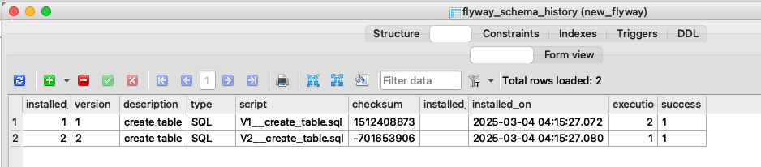
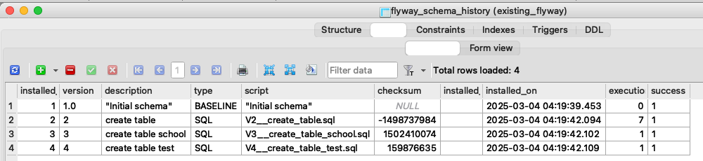

# Flyway Migration using SQLite database

This guide explains how to set up Flyway for new and an existing database.
## Usage of Flyway Migration

### 1. **Flyway Migration for startup**
a. Install Flyway.
> brew install flyway

b. Setup Config file
> Example flyway.conf file from new database project

c. Place your migration Files:
>  place your SQL files in sql/migration as mentioned in project

d. Naming convention for SQL DDLs.
> V1__create_table.sql

e. Run Migration.
> flyway migrate

f. Result:

g. From new_database project run migration script
> flyway_migration.py.py

### 2. **Flyway Migration for existing database**
a. Repeat steps 1a - 1d   

b. Create a baseline
> flyway baseline

c. Run Migration.
> flyway migrate

d. Result:

e. From existing_database project run migration script
> existing_flyway_migration.py

## Download CLI

Download Link
> https://flyway.red-gate.com/download-cli

Once downloaded, you will have a .tar.gz archive. Extract it to a location of your choice, for example:
> tar -xvf flyway-commandline-<version>-macosx.tar.gz

Move Flyway to a Suitable Location (Optional):
If you want Flyway to be available system-wide, you can move the extracted folder to a directory like /usr/local/ or /opt/. For example:
> sudo mv flyway-<version> /usr/local/flyway

Add Flyway to the PATH:  
To use Flyway globally from the terminal, you need to add the flyway command to your system’s PATH.  

You can do this by editing your shell’s profile configuration file (such as .bash_profile, .zshrc, or .bashrc, depending on your shell).
> nano ~/.zshrc

Then add the following line:
> export PATH=$PATH:/usr/local/flyway

Verify the Installation:
To check if Flyway has been installed correctly, run:
> flyway -v